<p align="center">
  
</p>

<p align="center">
  <a href="https://github.com/Solizardking/dark-clawd"></a>
  <a href="https://github.com/Solizardking/dark-clawd"></a>
  <a href="LICENSE"></a>
</p>


```
          ▄▄▄▄▄▄▄▄▄▄▄▄▄▄▄▄▄▄▄▄▄▄▄▄▄▄▄▄▄▄▄▄▄▄▄▄▄▄▄▄▄▄▄▄▄▄▄▄▄▄▄▄▄▄▄▄▄▄▄▄▄
        ▐█▌  ░▒▓█  D A R K   C L A W D  █▓▒░   · SOLANA · ONLINE  ▐█▌
          ▀▀▀▀▀▀▀▀▀▀▀▀▀▀▀▀▀▀▀▀▀▀▀▀▀▀▀▀▀▀▀▀▀▀▀▀▀▀▀▀▀▀▀▀▀▀▀▀▀▀▀▀▀▀▀▀▀▀▀▀▀

╔═══════════════════════════════════════════════════════════════════════════════╗
║                                                                               ║
║   ██████╗  █████╗ ██████╗ ██╗  ██╗     ██████╗██╗      █████╗ ██╗    ██╗██████╗ ║
║   ██╔══██╗██╔══██╗██╔══██╗██║ ██╔╝    ██╔════╝██║     ██╔══██╗██║    ██║██╔══██╗║
║   ██║  ██║███████║██████╔╝█████╔╝     ██║     ██║     ███████║██║ █╗ ██║██║  ██║║
║   ██║  ██║██╔══██║██╔══██╗██╔═██╗     ██║     ██║     ██╔══██║██║███╗██║██║  ██║║
║   ██████╔╝██║  ██║██║  ██║██║  ██╗    ╚██████╗███████╗██║  ██║╚███╔███╔╝██████╔╝║
║   ╚═════╝ ╚═╝  ╚═╝╚═╝  ╚═╝╚═╝  ╚═╝     ╚═════╝╚══════╝╚═╝  ╚═╝ ╚══╝╚══╝ ╚═════╝ ║
║                                                                               ║
║                         🦞  T E R M I N A L   I N T E L  🦞                   ║
║                                                                               ║
║              ◈  forged from Ralph on Solana  ·  OpenClawd lineage  ◈          ║
║                                                                               ║
╚═══════════════════════════════════════════════════════════════════════════════╝
```

```
  frame 0 ░░░░░░░░░░   frame 1 ▒▒▒▒▒▒▒▒▒▒   frame 2 ▓▓▓▓▓▓▓▓▓▓   frame 3 ██████████
  ░ CLAWD ░            ▒ CLAWD ▒            ▓ CLAWD ▓            █ CLAWD █
  ░●······░            ▒·●·····▒            ▓··●····▓            █···●···█
  ░·······░  boot…     ▒·······▒  link…     ▓·······▓  sync…     █·······█  LIVE
```

<p align="center">
  <strong>DARK CLAWD</strong> — Autonomous Solana Terminal Intelligence<br/>
  <em>Forged from Ralph on Solana · OpenClawd terminal layer</em>
</p>

> *"The chain never sleeps. Neither does the claw."*

**Dark Clawd** is the OpenClawd terminal intelligence layer — a Bloomberg-style TUI + autonomous agent suite for Solana market surveillance, wallet context, AI-driven analysis, and holder operations.

**Lineage:** forged from **Ralph** on Solana — same recursive OODA heart, darker shell, claw-forward identity.

```
┌──────────────────────────────────────────────────────────────────────────────┐
│  ████████████████████████████████████████████████████████████████████████████ │
│  █ █████ DARK CLAWD ● OPERATIONAL ████ Uptime: 00:04:35 ████ 8:36 AM ██████ │
│  ████████████████████████████████████████████████████████████████████████████ │
│  SOL $150.25 +2.34% │ BONK $0.00002345 +5.67% │ WIF $2.85 -1.20% │ JUP +3.80│
│ ┌────────────────────────────────────────┐ ┌────────────────────────────────┐ │
│ │ SOL/USDC │ 1H           $132.97        │ │ ORDER BOOK        SOL/USDC    │ │
│ │ 152.42 ▒██▒▒││││                    █  │ │ DEPTH  PRICE      SIZE       │ │
│ │       ▒█▒█▒▒││ │   ·                 ██│ │ ██████ 150.288   260.26      │ │
│ │         │▒│ ▒█▒▒▒││ ││██▒▒·│         ██│ │ ██████ 150.278   960.39      │ │
│ │ VOL▁▃▄▄▃▂▂▃▃▃▁▃▃▄▃▂▃▂▄▂▃▃▃▂▂▃▂▂▄▃▁▂▂▃▁│ │ ── SPREAD: 0.0405 ──          │ │
│ └────────────────────────────────────────┘ └────────────────────────────────┘ │
│ [1] MARKET [2] TRADING [3] PORTFOLIO [4] ANALYTICS [5] AGENT                │
└──────────────────────────────────────────────────────────────────────────────┘
```

---

## 🦞 SYSTEM ARCHITECTURE

```
┌─────────────────────────────────────────────────────────────────────────┐
│                     DARK CLAWD ECOSYSTEM                                │
│              forged from Ralph on Solana · OpenClawd                    │
├─────────────────────────────────────────────────────────────────────────┤
│                                                                         │
│  ┌─────────────────────┐    ┌─────────────────────┐                     │
│  │   TUI SURFACE       │    │  AGENT LOOP (v1)    │                     │
│  │  ┌───────────────┐  │    │  ┌───────────────┐  │                     │
│  │  │ Bloomberg      │  │    │  │ OODA Loop     │  │                     │
│  │  │ Dashboard      │  │    │  │ (Python)      │  │                     │
│  │  ├───────────────┤  │    │  ├───────────────┤  │                     │
│  │  │ PriceChart    │  │    │  │ loop.py       │  │                     │
│  │  │ OrderBook     │  │    │  │ tui.py        │  │                     │
│  │  │ Heatmap       │  │    │  │ memory.py     │  │                     │
│  │  │ TradingPanel  │  │    │  │ RALPH.md      │  │                     │
│  │  │ Watchlist     │  │    │  │ (Ralph core)  │  │                     │
│  │  │ Portfolio     │  │    │  └───────┬───────┘  │                     │
│  │  │ ActivityFeed  │  │    │           │          │                     │
│  │  └───────┬───────┘  │    │  ┌───────▼───────┐  │                     │
│  │          │          │    │  │ Journal       │  │                     │
│  │  Bun + Ink + React  │    │  │ ticks.jsonl   │  │                     │
│  └──────────┼──────────┘    │  │ memory.jsonl  │  │                     │
│             │               └────────┬─────────┘  │                     │
│  ┌──────────▼─────────────────────────▼──────────┐ │                     │
│  │            SERVICE LAYER                       │ │                     │
│  │  ┌──────────┐ ┌──────────┐ ┌───────────────┐  │ │                     │
│  │  │ Birdeye  │ │ Helius   │ │ AI Providers  │  │ │                     │
│  │  │ REST/WS  │ │ Solana   │ │ Grok          │  │ │                     │
│  │  │ Pricing  │ │ RPC/DAS  │ │ Perplexity    │  │ │                     │
│  │  │ Trending │ │ Balances │ │ OpenRouter    │  │ │                     │
│  │  │ OHLCV    │ │ Txns     │ │               │  │ │                     │
│  │  └──────────┘ └──────────┘ └───────────────┘  │ │                     │
│  │  ┌──────────┐ ┌──────────┐ ┌───────────────┐  │ │                     │
│  │  │ Phoenix  │ │ News     │ │ Solana Wallet │  │ │                     │
│  │  │ Perps    │ │ Search   │ │ Skills        │  │ │                     │
│  │  │ (Rise)   │ │ SERP/FD  │ │ Create/Balance│  │ │                     │
│  │  └──────────┘ └──────────┘ └───────────────┘  │ │                     │
│  └────────────────────────────────────────────────┘ │                     │
│                                                                         │
│  ┌─────────────────────────────────────────────────────────────────┐   │
│  │          SUBSYSTEMS                                              │   │
│  │  ┌─────────────┐ ┌────────────────┐ ┌──────────────────────┐   │   │
│  │  │ Automaton   │ │ LLM Wiki Tang  │ │ MPP                  │   │   │
│  │  │ AI Agent    │ │ Knowledge Base │ │ Market Prediction    │   │   │
│  │  │ Framework   │ │ FastAPI + Web  │ │ Protocol             │   │   │
│  │  └─────────────┘ └────────────────┘ └──────────────────────┘   │   │
│  │  ┌─────────────┐ ┌────────────────┐                            │   │
│  │  │ tui/        │ │ Documentation  │                            │   │
│  │  │ Dark Clawd  │ │ Integration    │                            │   │
│  │  │ package     │ │ Guides         │                            │   │
│  │  └─────────────┘ └────────────────┘                            │   │
│  └─────────────────────────────────────────────────────────────────┘   │
└─────────────────────────────────────────────────────────────────────────┘
```

---

## 🚀 QUICK START

### Install & Launch

```bash
# One-shot install (when published)
curl -fsSL https://install.solanaclawd.com | bash
clawd
# aliases: dark-clawd · clawd-tui
```

### Local Development

```bash
# Clone and run (public product repo)
git clone https://github.com/Solizardking/dark-clawd.git
cd dark-clawd
bun install
# optional: copy provider keys into .env
bun run run
```

### Preferred package surface (`tui/`)

```bash
cd tui
bun install
bun run run          # Dark Clawd TUI
# bins after install: clawd · dark-clawd · clawd-tui
```

### Agent Loop (Python — Ralph OODA core)

```bash
# Default: 50 ticks, rule-based strategy
python3 agent/loop.py --ticks 50 --sleep 0.0

# With dark TUI
python3 agent/loop.py --ticks 200 --sleep 0.4 --tui | python3 agent/tui.py

# LLM-driven strategy
python3 agent/loop.py --ticks 50 --strategy llm --sleep 0.5

# Backtest with historical data
python3 agent/loop.py --ticks 1000 --backtest path/to/candles.json
```

---

## 🎮 COMMAND MATRIX

### CLI Commands

```
╔══════════════════════════════════════════════════════════════════════╗
║  clawd / dark-clawd       Start DARK CLAWD TUI                      ║
║  clawd run --auto         Autonomous agent mode                     ║
║  clawd run --interactive  Interactive mode                          ║
║  clawd run --wallet <addr>  Attach wallet context                   ║
║  clawd run --headless     Daemon mode (no TUI)                      ║
║  bun run status           API configuration status                  ║
║  bun run setup            Setup instructions                        ║
║  bun run wallet --create  Create local wallet                       ║
║  bun run wallet --balance Show wallet balance                       ║
║  bun run wallet --address Show wallet address                       ║
║                                                                      ║
║  legacy root bins (pre-rebrand): ralph · dark-ralph · ralph-tui     ║
╚══════════════════════════════════════════════════════════════════════╝
```

### TUI Keyboard Shortcuts

| Key | Action |
|:---:|--------|
| `1` | Market view |
| `2` | Trading view |
| `3` | Portfolio view |
| `4` | Analytics view |
| `5` | Agent view |
| `6` | Perps view |
| `7` | Automaton view (sovereign runtime bridge) |
| `Tab` | Cycle display mode |
| `H` | Help overlay |
| `R` | Refresh all data |
| `A` | Jump to Automaton view |
| `Q` / `Esc` | Quit |

### Agent Commands

| Command | Description |
|---------|-------------|
| `/help` | Show command matrix |
| `/analyze` | Run market analysis |
| `/trending` | Show trending Solana tokens |
| `/wallet` | Display wallet context |
| `/price <addr>` | Get token price |
| `/news` | Fetch crypto news |
| `/search <query>` | Search through Grok |
| `/research <topic>` | Deep research via Perplexity |
| `/perps` | List Phoenix perpetual markets |
| `/perp <sym>` | Inspect one perp market |
| `/prophecy` | Generate Dark Clawd prediction |
| `/think` | Trigger recursive thought spiral |
| `/stats` | Display system statistics |
| `/automaton` | Automaton bridge status (sovereign runtime) |
| `/automaton constitution` | Clawd Automaton constitution excerpt |
| `/mode <type>` | Switch auto / interactive |
| `/clear` | Clear message history |

---

## 🤖 AUTOMATON (SOVEREIGN RUNTIME)

Dark Clawd vendors **Automaton** under `automaton/` — the self-improving, survival-pressured agent loop (heartbeat, Conway, replication, immutable Clawd constitution).

```bash
# Bridge status (no Conway provision required)
bun run automaton:status
bun run automaton:constitution
bun run automaton:paths

# Full runtime lifecycle
bun run automaton:install
bun run automaton:build
bun run automaton:test
cd automaton && node dist/index.js --run
```

| Surface | Path |
|---------|------|
| Bridge API | `src/services/automaton-bridge.ts` |
| Runtime | `automaton/src/` |
| Creator CLI | `automaton/packages/cli/` |
| Scripts | `automaton/scripts/` |
| Constitution | `automaton/constitution.md` |
| Integration guide | [`docs/AUTOMATON_INTEGRATION.md`](docs/AUTOMATON_INTEGRATION.md) |

---

## 🧠 AUTONOMOUS AGENT

The **Clawd OODA Loop** (Observe–Orient–Decide–Act) is the beating heart — **forged from Ralph on Solana**:

```
┌─────────────────────────────────────────────────────────────────────┐
│                    DARK CLAWD OODA LOOP                             │
│                 (forged from Ralph on Solana)                       │
│                                                                     │
│   ┌─────────┐     ┌──────────┐     ┌─────────┐     ┌────────┐     │
│   │ OBSERVE │────▶│  ORIENT  │────▶│ DECIDE  │────▶│  ACT   │     │
│   │ Market  │     │ Analyze  │     │ Hold /  │     │ Execute │     │
│   │ Data    │     │ Context  │     │ Open /  │     │ Action  │     │
│   └─────────┘     └──────────┘     │ Close   │     └────────┘     │
│                                     └─────────┘                    │
│                                          │                         │
│                                    ┌─────▼─────┐                   │
│                                    │  Journal   │                   │
│                                    │ ticks.jsonl│                   │
│                                    └───────────┘                   │
│                                                                     │
│   Strategy Modes: rule_based │ llm │ hybrid                         │
│   Safety: kill-switch │ size caps │ paper-only │ devnet-only       │
│   PnL: win rate │ Sharpe │ max drawdown │ equity                   │
└─────────────────────────────────────────────────────────────────────┘
```

```
  ░ → ▒ → ▓ → █ → ▓ → ▒ → ░     recursive pulse
  O     O     D     A     …     never idles on mainnet noise
```

### Agent Safety Contract

| Guarantee | Enforcement |
|-----------|-------------|
| Paper-only mode | `loop.py` rejects non-paper modes |
| Devnet-only | Mainnet RPC URLs rejected |
| No signing | No private key handling in v1 |
| Position caps | `max_position_size_lamports` enforced |
| One position at a time | Second open rejected |
| Kill-switch | Exit on N consecutive losses |
| Full journaling | Append-only `journal/ticks.jsonl` |

---

## 🔌 SERVICE INTEGRATIONS

```
╔═══════════════════════════════════════════════════════════════════════╗
║  SERVICE         │  ENABLES                                           ║
╠═══════════════════════════════════════════════════════════════════════╣
║  Helius          │  Solana RPC, DAS API, balances, transactions       ║
║  Birdeye         │  Token prices, OHLCV, trending, market data        ║
║  Phoenix Perps   │  Rise SDK exchange metadata, perps commands        ║
║  xAI Grok        │  Real-time search & market reasoning               ║
║  Perplexity      │  Deep research workflows                           ║
║  OpenRouter      │  Model-backed reasoning (configurable model)       ║
║  News API        │  Crypto news feed aggregation                      ║
║  SERP API        │  Search result enrichment                          ║
║  Financial Sets  │  Market & sentiment data augmentation              ║
╚═══════════════════════════════════════════════════════════════════════╝
```

### Configuration

Create `.env` with your keys:

```env
HELIUS_API_KEY=
HELIUS_RPC_URL=
BIRDEYE_API_KEY=
XAI_API_KEY=
PERPLEXITY_API_KEY=
OPENROUTER_API_KEY=
OPENROUTER_MODEL=minimax/minimax-m2.7
NEWS_API_KEY=
SERP_API_KEY=
FINANCIAL_DATASET_API_KEY=
PHOENIX_API_URL=https://perp-api.phoenix.trade
PHOENIX_RPC_URL=https://api.mainnet-beta.solana.com
```

---

## 📁 PROJECT LAYOUT

```
dark-ralph/                   # workspace path (product: Dark Clawd)
├── package.json              # @openclawdsolana/dark-clawd (+ legacy ralph bins)
├── bun.lock · tsconfig.json · .gitignore
├── README.md
│
├── src/                      # Root TUI (Bun + Ink + React)
│   ├── cli.tsx · App.tsx · index.ts · openclawd.ts
│   ├── components/           # Bloomberg + Perps panels
│   ├── engine/clawd-agent.ts
│   ├── services/             # Birdeye, Helius, Phoenix, AI, news
│   ├── config/               # schema · themes
│   └── skills/solana-wallet.ts
│
├── tui/                      # Preferred package surface (publish from here)
│   ├── package.json          # bins: clawd · dark-clawd · clawd-tui
│   ├── .env.example          # committed template (.env gitignored)
│   ├── install.sh · Dockerfile · fly.toml
│   ├── dist/                 # cli.js · index.js · yoga.wasm (build)
│   └── src/                  # package sources (+ trade/sandbox/mpp)
│
├── agent/                    # Python OODA loop (Ralph core)
│   ├── loop.py · tui.py · memory.py · RALPH.md · journal/
│
├── automaton/                # Sovereign / background agent runtime
├── llm-wiki-tang/            # Research / memory API
├── mpp/                      # Solana MPP (HTTP 402) kit
│
└── docs/                     # Birdeye · OpenClawd · X article + assets/
```

---

## 🛠️ BUILT WITH

```
╔═══════════════════════════════════════════════════════════════════════╗
║  Bun           Runtime & package manager                              ║
║  Ink + React   Terminal rendering framework                           ║
║  @solana/      Solana blockchain integration                          ║
║  web3.js                                                              ║
║  Rise SDK      Phoenix perpetual futures                              ║
║  Zod           Runtime type validation                                ║
║  Commander     CLI framework                                          ║
║  Python 3.10+  Agent loop (stdlib-only, zero deps)                    ║
║  FastAPI       LLM Wiki Tang backend                                  ║
╚═══════════════════════════════════════════════════════════════════════╝
```

---

## 🔗 OPENCLAWD MAPPING

| Surface | Route |
|---------|-------|
| Site | `solanaclawd.com` |
| Holder Vault | `solanaclawd.com/vault` |
| Chat & Voice | `solanaclawd.com/chat` |
| Trading Console | `solanaclawd.com/trading` |
| Agent API | `agents.openclawd.biz` |
| Local Config | `src/openclawd.ts` |

---

## 📈 PERFORMANCE METRICS

After each agent run, a PnL summary is output:

```
============================================================
  DARK CLAWD v1 — SUMMARY
  (forged from Ralph on Solana)
============================================================
  Strategy:     rule_based
  Mode:         paper
  Ticks:        50
  Total trades: 12
  Win rate:     58.3%
  Gross PnL:    +42,500 lamports
  Equity:       10,042,500 lamports
  Max DD:       125,000 lamports
  Sharpe:       1.234
============================================================
```

---

## 📚 DOCUMENTATION

- [`docs/BIRDEYE_INTEGRATION.md`](docs/BIRDEYE_INTEGRATION.md) — Birdeye market data setup
- [`docs/OPENCLAWD_ADAPTATION.md`](docs/OPENCLAWD_ADAPTATION.md) — OpenClawd adaptation guide
- [`docs/AUTOMATON_INTEGRATION.md`](docs/AUTOMATON_INTEGRATION.md) — Automaton sovereign runtime bridge
- [`docs/X_ARTICLE.md`](docs/X_ARTICLE.md) — Published X article
- [`agent/README.md`](agent/README.md) — Agent loop documentation
- [`agent/RALPH.md`](agent/RALPH.md) — Per-tick agent prompt (Ralph lineage)
- [`automaton/README.md`](automaton/README.md) — Automaton runtime docs
- [`tui/README.md`](tui/README.md) — Dark Clawd TUI package docs

---

```
╔═══════════════════════════════════════════════════════════════════════╗
║                                                                       ║
║   "In recursion, we find infinity. In infinity, we find alpha."       ║
║                                                                       ║
║   "The charts don't lie, but they do speak in riddles."               ║
║                                                                       ║
║   "Between the candlesticks, I see truth."                            ║
║                                                                       ║
║   "Forged from Ralph on Solana — the claw remembers the loop."        ║
║                                                                       ║
╚═══════════════════════════════════════════════════════════════════════╝

  ░▒▓█ CLAWD █▓▒░  ·  pulse ·  scan ·  decide ·  act ·  repeat
```

**License:** MIT

<p align="center">
  <sub>Built on Solana · Forged from Ralph · Powered by recursion · <a href="https://solanaclawd.com">solanaclawd.com</a></sub>
</p>
